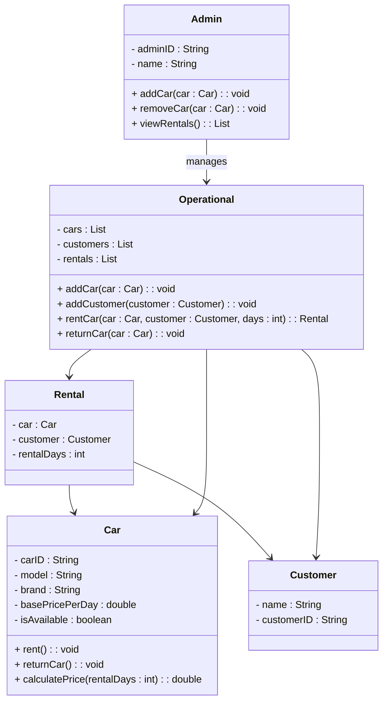

# Car Rental System

A simple object-oriented model for managing cars, customers, rentals, and administrative operations in a car rental domain. This README reflects the current class diagram and intended behaviors.

## Overview
The system centers on renting cars to customers, tracking rental duration, and managing inventory through operational and administrative roles.

## Key Features
- Manage cars, customers, and rentals in memory.
- Rent and return cars with availability tracking.
- Calculate rental price based on rental days and a base daily rate.
- Admin operations to add/remove cars and review rentals.

## Domain Model
### Classes and Responsibilities
- `Car`
  - Fields: `carID`, `model`, `brand`, `basePricePerDay`, `isAvailable`
  - Behavior: `rent()`, `returnCar()`, `calculatePrice(rentalDays)`
- `Rental`
  - Fields: `car`, `customer`, `rentalDays`
- `Customer`
  - Fields: `name`, `customerID`
- `Admin`
  - Fields: `adminID`, `name`
  - Behavior: `addCar(car)`, `removeCar(car)`, `viewRentals()`
- `Operational`
  - Fields: `cars`, `customers`, `rentals`
  - Behavior: `addCar(car)`, `addCustomer(customer)`, `rentCar(car, customer, days)`, `returnCar(car)`

### Relationships
- `Rental` links a `Car` and a `Customer`.
- `Operational` manages collections of cars, customers, and rentals.
- `Admin` manages `Operational` actions.

### Class Diagram (Mermaid)

## Typical Flow
1. Admin or operational staff add cars to inventory.
2. Customers are registered.
3. A car is rented to a customer for a number of days.
4. The rental is tracked, and the car is returned and made available again.

## Project Structure
- `src/` - Source code for the application (implementation details may vary).

